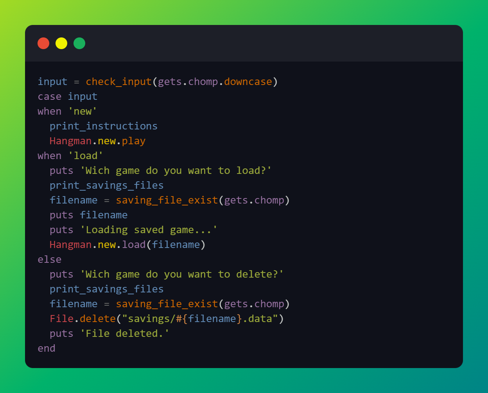
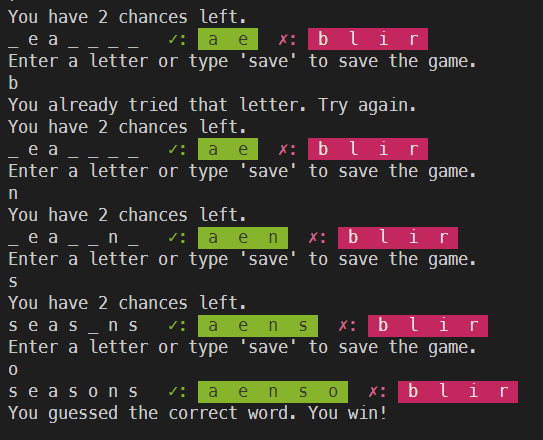

# Hangman

This project consists of creating a hangman game. There is also the possibility to save and load games.
at the begging you are prompt wich a choice to play a new game, load an existing one or delete a saving file (like in the code snippet below).

  

Below there is also a possibile outcome in the terminal, when you are playing. Every turn you'll be prompted with how many chances you still have,
your current progress in guessing the world, and your previuos guesses (divided in correct and incorrect)

  

